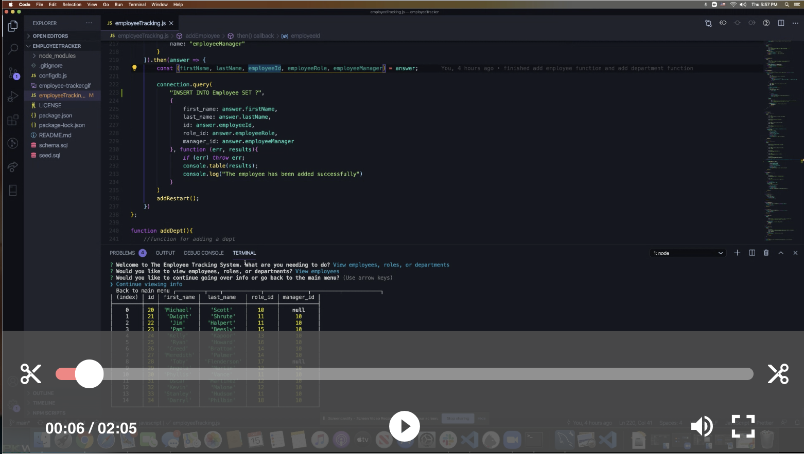
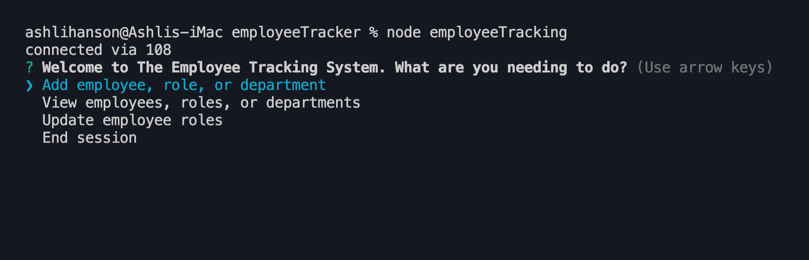
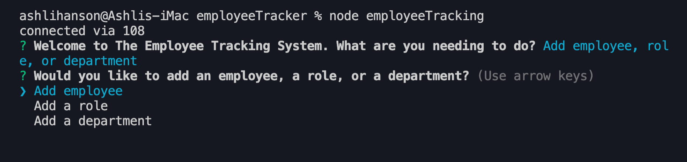
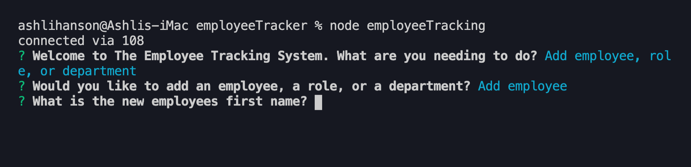
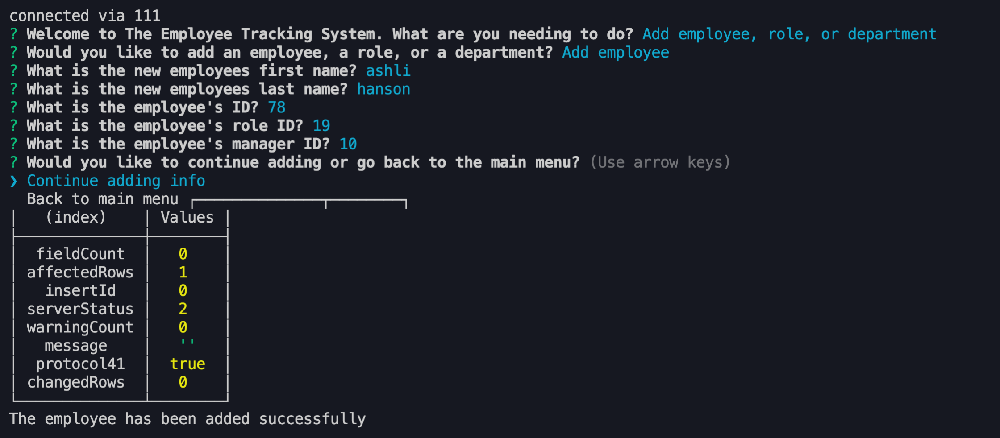
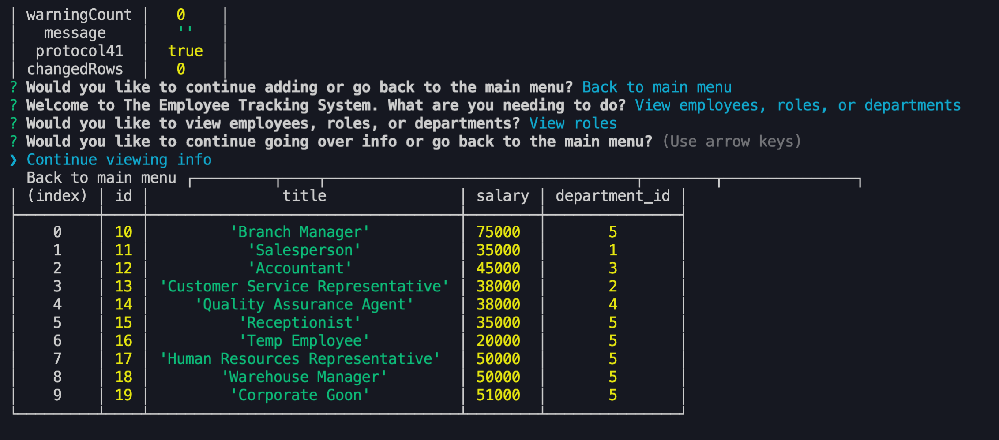
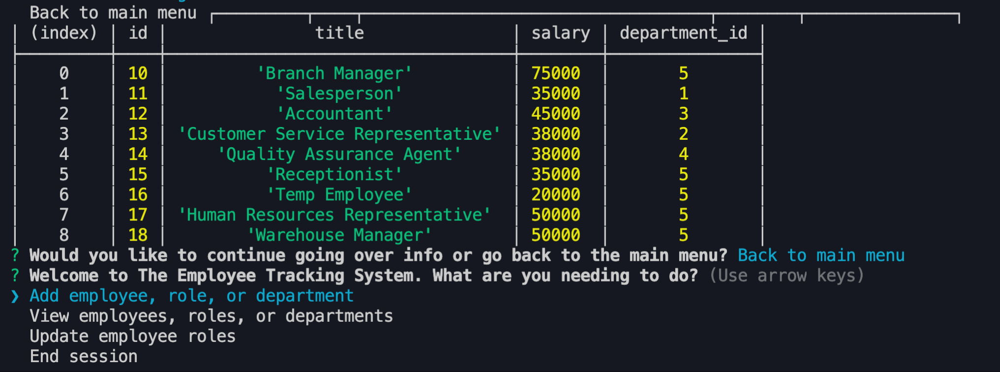
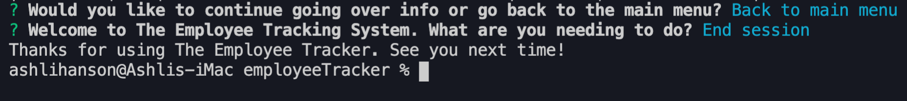

# The Employee Tracking System 
 An express application using node, inquirer, and MySQL designed for managing a company's employees and their payroll info. 
 # Watch the video here!
 
 ## Table of Contents 
 * [Installation Instructions](#Installation-Instructions) 
 * [Instructions for Use](#Instructions-for-Use) 
 * [Questions](#Questions) 
 * [License](#License) 
 ## Installation Instructions 
 Clone or fork the repo to your own machine and npm install inquirer and mysql. 
 ## Instructions for Use 
 
 Once packages have been install, enter "node employeeTracking" into the integrated terminal and answer the prompts as followed based on what task you would like to complete. The following screenshots are specifically adding an employee and viewing the addition and then ending the session.
 
 
 
 
   
 
 ## Questions  
 * Github Username: ashlinhanson 
 * Email: ashlinhanson@gmail.com 
 * How to contact: Email. 
 ## License   
 Copyright (c) 2020 Ashli Hanson Licensed under the MIT license.